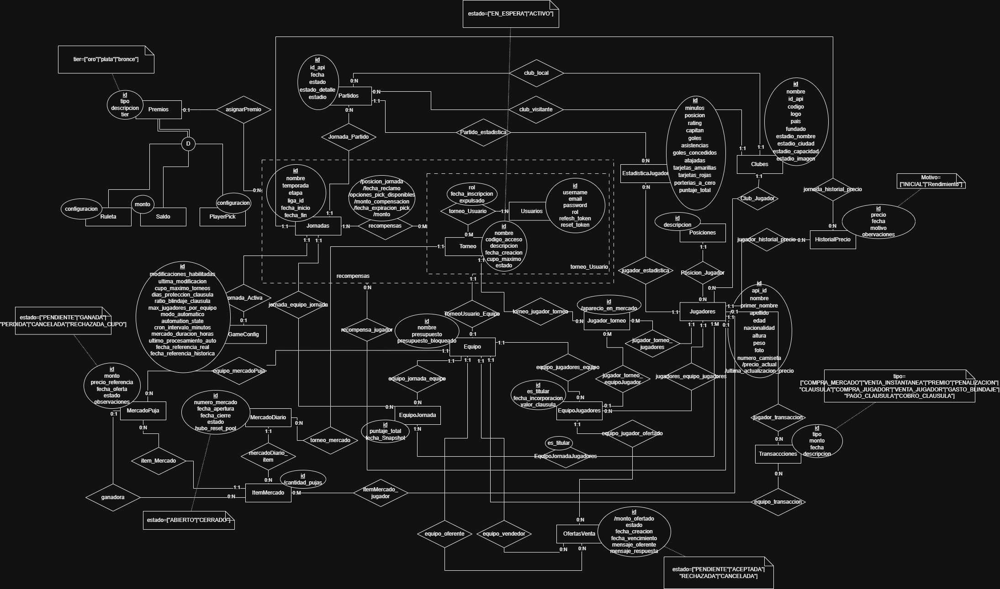

# Propuesta TP DSW

## Grupo
### Integrantes
* 52867 - Mazalan, Ariel Ignacio
* 52831 - Pacheco, Santiago Tomas
* 52309 - Ribotta, Tomas Nicolas

## Como utilizar la aplicacion: [Guia de uso](HowToUse.md)

### Repositorios
* [frontend app](https://github.com/TomasRibotta20/FrontEnd_fantasy)
* [backend app](https://github.com/TomasRibotta20/BackEnd_Fantasy)

## Links PR/MR

### Backend
* [Pull requests backend](https://github.com/TomasRibotta20/BackEnd_Fantasy/pulls?q=is%3Apr+is%3Aclosed)

Debido a un error inicial en el flujo de trabajo, las primeras funcionalidades se integraron mediante merge local. Como evidencia de la integración, se adjuntan los links a los Issues y los SHAs de los commits de cada funcionalidad.
#### Featureds
* [Position CRUD](https://github.com/TomasRibotta20/BackEnd_Fantasy/commit/411f56688ba1c282b7999aaab0ad8deacc4b92c4#diff-9323ef9ef0b095479dd6ac55023ee38e2a3afe63810172ae1611742574d4a3fa)
* [Login](https://github.com/TomasRibotta20/BackEnd_Fantasy/commit/ece104152e98ce6ad9137db908c3fd32e29b1d2e)
* [Zod](https://github.com/TomasRibotta20/BackEnd_Fantasy/commit/600db5834f7c8397e8def12484cfd9a0451a3068)
* [Error Handler](https://github.com/TomasRibotta20/BackEnd_Fantasy/commit/6d5d153ebcd4a3551fe2ec46ced4efc971e5b795)
* [Mailer](https://github.com/TomasRibotta20/BackEnd_Fantasy/commit/65650e26c3244861116e8ac6a8202637ac0e2186#diff-9ed00ecbde57465cf455979021274ab9f905e38f15eadbb3d0f32c91befd3da9)
### Frontend
* [Pull requests frontend](https://github.com/TomasRibotta20/FrontEnd_fantasy/pulls?q=is%3Apr+is%3Aclosed)

## Tema
### Descripción

Una aplicacion web de "Fantasy Futbol" en la cual cada usuario puede construir su propio equipo de 11 jugadores titulares y 4 suplentes adquiridos desde un mercado basado en la Liga Argentina de Futbol y afiliarse a un torneo con otros usuarios. Estos jugadores iran sumando puntos semanalmente en funcion de su rendimiento en la vida real, que luego seran usados para determinar que usuario conformo el mejor equipo. Cada usuario comenzara con 11 jugadores al azar (que no excedan un monto especifico) y un pequeño presupuesto. Cada jugador tiene un precio establecido el cual variaria dependiendo de sus ultimas actuaciones en partidos. Los usuarios pueden adquirir estos jugadores en un mercado que se actualizara constantemente con jugadores aleatorios, tambien pueden comprarselos a otros usuarios pagando una clausula de rescision o haciendoles una oferta. Sumado a esto cada usuario puede vender sus jugadores en el mercado a un porcentaje del precio que el mismo tenga en el momento. Al final de la semana se conformara un podio entre los usuarios de una misma liga dependiendo de la cantidad de puntos que tengan, y en base a ese podio se repartiran las distintas recompensas dentro de las cuales los usuarios podran elegir premios monetarios o premios por probabilidades (como ruletas y elecciones entre jugadores).

### Der Aprobación directa

## Alcance Funcional 

### Alcance Mínimo

Regularidad:
|Req|Detalle|
|:-|:-|
|CRUD simple|1. CRUD Usuario 2. CRUD Club 3. CRUD Posición |
|CRUD dependiente|1. CRUD Partido {depende de} CRUD Equipo y CRUD Jugador 2. CRUD Jugador {depende de} CRUD Posición y CRUD Club|
|Listado + detalle| 1. Listado de jugadores filtrado por club => detalle muestra datos completos de jugador  2. Listado de jugadores filtrado por posición => detalle muestra datos completos de cada jugador|
|CUU/Epic|1. Modificar equipo (En el momento en el cual el usuario desea crear un equipo le coloca un nombre y se creara un equipo con 11 jugadores aleatorios titulares y 4 suplentes, el cual posteriormente cuando este desee podrá modificar a su gusto ya que en esta instancia del proyecto los jugadores no van a tener un precio ni los usuarios presupuesto, por lo cual tendra acceso a cualquier jugador que este en la base de datos) 2. Calcular puntaje para Jornada (El administrador primeramente tendra que deshabilitar las modificaciones para indicarles a los usuarios que la jornada esta activa y no permitirles cambiar mas su equipo. Luego de eso procesara los datos para la jornada que estaria activa en la vida real, en esto se obtienen los datos de los partidos a traves de una api externa, se calculan los puntajes segun las reglas de negocio de nuestro proyecto y luego se guardan en la base de datos. Luego el administrador podra habilitar nuevamente las modificaciones y los usuarios ver su puntaje para su equipo en cada una de las jornadas donde participo.)|

Adicionales para Aprobación
|Req|Detalle|
|:-|:-|
|CRUD |1. CRUD Usuario 2. CRUD Club 3. CRUD Posición 4. CRUD Jugador 5. CRUD Precio 6. CRUD Jornada 7 CRUD Partido 8. CRUD Liga|
|CUU/Epic|1. Calcular puntaje para Jornada(Se mantiene igual que en Regularidad) 2. Crear torneo (El usuario podra crear un torneo e invitar amigos para jugar contra ellos. El torneo inicialmente estara en espera hasta que entren todos los usuarios y luego de que esto suceda el creador debera iniciar el torneo, esto hara que se le asignen los equipos a todos los usuarios, junto con su presupuesto. Una vez el torneo esta iniciado ningun usuario podra unirse. Luego de procesada cada jornada se asignaran recompensas a los usuarios con mas puntos entre sus titulares para ese torneo.) 3. Modificar equipo(A diferencia de regularidad al haber incluido los precios de los jugadores y las ventas y compras, los usuarios no podran elegir cualquier jugador para tener en su alineacion, solo podran cambiar jugadores de posicion, ya que unicamente los titulares de cada equipo contaran a la hora de calcular los premios.)|

### Alcance Adicional Voluntario

|Req|Detalle|
|:-|:-|
|Listados |1. Listados de jugadores filtrados por precio, país, posición y equipo 2. Listado de puntos de usuarios de un torneo filtrado por jornadas|
|CUU/Epic|1. Compras/Ventas (Comprar/vender juador a otro usuario de ese torneo o al mercado) 2. Generar mercado diario (Habrá una tienda en la cual diariamente apareceran 10 jugadores a precio de mercado y donde los usuarios pueden competir entre ellos para comprarlos, a traves de un metodo de subastas ciegas) 3. Asignar Recompensas a los usuarios (Al final de cada jornada se asignaran Recompensas a los usuarios, en funcion de los puntos conseguidos por sus titulares. Las recompensas seran mejores si es mejor la posicion del usuario. Los usuarios podran elegir entre diferentes premios ya sean monetarios o jugadores aleatorios ) 4. Modificar clausula de un jugador (Los usuarios tendran la posibilidad de comprar jugadores de otros usuarios unicamente por clausula de rescision. Cada usuario podra modificar la clausula de rescision de sus jugadores gastando saldo para ello)|

